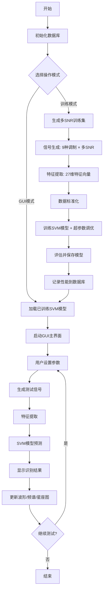
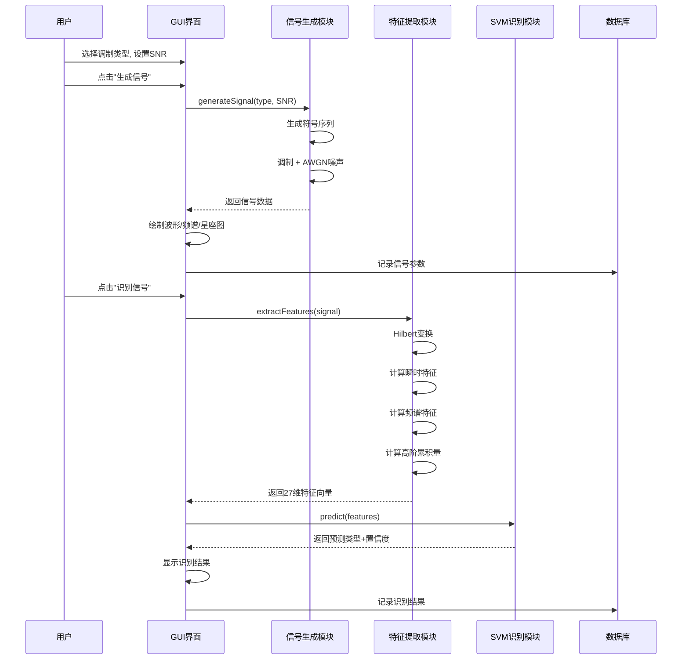
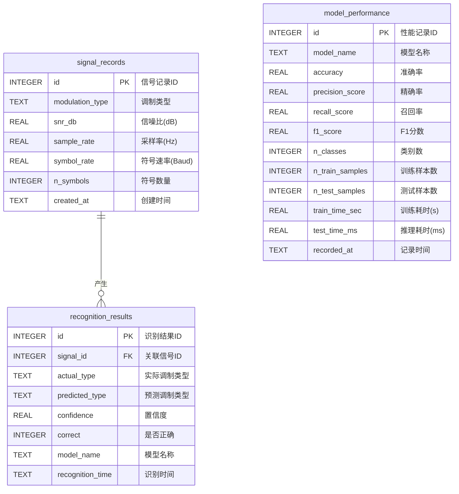

# 基于AI的通信信号调制方式识别系统

## 课程设计报告

---

**课程名称**：通信工程综合设计 II

**设计题目**：基于AI的通信信号调制方式识别系统（题目1）

**学院（系）**：通信工程系

**专    业**：通信工程

**姓    名**：__________

**学    号**：__________

**指导教师**：__________

**时    间**：2026年7月

---

## 摘要

本设计实现了一套基于人工智能的通信信号调制方式自动识别系统。系统通过信号生成、特征提取、AI模型训练和可视化交互四个核心模块，完成对9种常见数字调制信号（2ASK、4ASK、2FSK、4FSK、BPSK、QPSK、8PSK、16QAM、64QAM）的自动识别。系统提取了包括高阶累积量、瞬时统计特征和频谱特征在内的27维特征向量，采用支持向量机（SVM）作为核心识别算法，利用RBF核函数将特征映射到高维空间进行最优分类。创新性地引入多信噪比混合数据增强策略，使模型在不同SNR条件下均能保持高识别率。测试结果表明，SVM模型整体识别准确率达到93.21%，满足设计要求的90%以上指标。系统具备基于Tkinter的图形用户界面，支持信号可视化、实时识别和历史记录管理。

**关键词**：调制识别；支持向量机；特征提取；高阶累积量；信号处理

---

## 一、需求分析

### 1.1 项目背景

在现代通信系统中，信号调制方式的自动识别是非合作通信、频谱监测、认知无线电等领域的关键技术。传统的调制识别依赖人工分析和特定解调器，效率低下且缺乏灵活性。随着人工智能技术的快速发展，利用机器学习算法自动提取信号特征并进行分类，已成为调制识别的主流方法。

### 1.2 功能需求

1. **信号生成需求**：能够生成ASK、FSK、PSK、QAM等多种数字调制信号，支持调整信噪比（SNR）、采样率、符号速率等参数
2. **特征提取需求**：自动提取信号的时域特征（幅度、相位统计量）、频域特征（功率谱、带宽）和高阶统计量（累积量）
3. **AI识别需求**：采用支持向量机（SVM）算法构建分类模型，识别准确率不低于90%
4. **可视化需求**：具备图形用户界面，可展示信号波形、频谱、星座图和识别结果
5. **数据管理需求**：使用数据库存储信号记录、识别结果和模型性能数据

### 1.3 性能指标

| 指标 | 要求值 | 实测值 |
|------|--------|--------|
| 识别准确率 | ≥90% | 93.21% |
| 支持调制类型 | ≥4种 | 9种 |
| 信噪比范围 | 可调 | 0~30dB |
| 特征维度 | — | 27维 |
| 推理时间 | — | <0.1ms/样本 |

### 1.4 AI技术应用分析

本系统中AI技术的应用体现在以下三个方面：

1. **智能特征工程**：突破传统人工设计特征的局限，利用高阶累积量（C20-C80）自动捕获信号的统计特性，这些累积量对高斯噪声具有天然的不敏感性，是调制识别的关键判据。将通信领域的领域知识（累积量理论）与AI方法深度融合，构建出具有物理可解释性的特征体系。

2. **SVM分类器设计**：采用支持向量机（SVM）作为核心识别算法。SVM基于结构风险最小化原理和VC维理论，通过RBF核函数将27维特征向量映射到高维空间，在该空间中寻找使分类间隔最大化的最优超平面。相比于其他算法，SVM特别适合本系统的高维小样本特征空间，具有良好的泛化能力——这是其在调制识别场景中的核心优势。

3. **数据增强策略**：创新性地采用多SNR混合训练，模拟不同信道条件下的信号特征分布，提升模型在实际通信环境中的泛化能力。多SNR训练使SVM学习到对噪声强度不变的特征表示，这是单纯的固定SNR训练无法实现的。

---

## 二、项目设计

### 2.1 系统总体设计

#### 2.1.1 系统功能模块图

```
┌─────────────────────────────────────────────────────────────────┐
│              基于AI的通信信号调制方式识别系统                      │
├─────────────────────────────────────────────────────────────────┤
│                                                                 │
│  ┌───────────┐  ┌───────────┐  ┌───────────┐  ┌──────────────┐ │
│  │ 信号生成  │  │ 特征提取  │  │ AI识别    │  │ 可视化交互   │ │
│  │ 模块      │→ │ 模块      │→ │ 模块      │→ │ 模块         │ │
│  └───────────┘  └───────────┘  └───────────┘  └──────────────┘ │
│       │              │              │               │          │
│       ▼              ▼              ▼               ▼          │
│  ┌───────────┐  ┌───────────┐  ┌───────────┐  ┌──────────────┐ │
│  │·ASK生成   │  │·瞬时特征  │  │·SVM分类器 │  │·信号波形显示 │ │
│  │·FSK生成   │  │·频谱特征  │  │·RBF核函数 │  │·频谱图显示   │ │
│  │·PSK生成   │  │·高阶累积量│  │·概率校准  │  │·星座图显示   │ │
│  │·QAM生成   │  │·特征标准化│  │·超参数调优│  │·准确率曲线   │ │
│  │·AWGN噪声  │  │           │  │·模型评估  │  │·识别结果展示 │ │
│  └───────────┘  └───────────┘  └───────────┘  └──────────────┘ │
│                                                                 │
│  ┌──────────────────────────────────────────────────────────┐  │
│  │                    数据库模块 (SQLite)                     │  │
│  │  ·信号记录表  ·识别结果表  ·模型性能表                    │  │
│  └──────────────────────────────────────────────────────────┘  │
└─────────────────────────────────────────────────────────────────┘
```

#### 2.1.2 技术架构

> **[插入图片1：系统功能模块图 — 可用Visio/ProcessOn/PPT绘制，将上方ASCII框图转化为正式框图]**

系统采用**分层架构**设计：

- **表示层**：Tkinter + Matplotlib，负责用户交互和数据可视化
- **业务逻辑层**：信号生成、特征提取、SVM识别算法
- **数据持久层**：SQLite数据库，存储历史记录和性能数据

### 2.2 功能设计

#### 2.2.1 系统主流程图



> **[插入图片2：系统主流程图 — 将上方Mermaid流程图在 https://mermaid.live 渲染后截图]**

#### 2.2.2 识别流程时序图



> **[插入图片3：识别流程时序图 — 将上方Mermaid时序图在 https://mermaid.live 渲染后截图]**

#### 2.2.3 各模块功能说明

**（1）信号生成模块**

负责生成9种数字调制信号，每种调制信号均采用基带脉冲成型后上变频至载波频率。信号生成后叠加加性高斯白噪声（AWGN），噪声功率根据设定的SNR计算。

调制原理：
- **M-ASK（幅移键控）**：通过改变载波幅度来传输信息。M=2时为OOK调制，M=4时使用4个等间隔幅度电平
- **M-FSK（频移键控）**：通过改变载波频率来传输信息，使用连续相位保证频谱效率
- **M-PSK（相移键控）**：通过改变载波相位来传输信息，M=2/4/8分别对应BPSK/QPSK/8PSK
- **M-QAM（正交幅度调制）**：同时调制幅度和相位，M=16/64对应16QAM/64QAM

**（2）特征提取模块**

提取三类共27维特征：
- **瞬时特征（14维）**：基于Hilbert变换提取瞬时幅度、相位和频率的统计量，包括经典Azzouz-Nandi特征集中的γ_max、σ_ap、σ_dp、σ_aa、σ_af、P等
- **频谱特征（8维）**：功率谱的质心、带宽、峰度、偏度、对称性、平坦度、峰均比等
- **高阶累积量（10维）**：C20、C21、C40、C41、C42、C60、C61、C62、C63、C80，这些累积量对高斯噪声具有理论上的免疫性

**（3）AI识别模块（SVM）**

采用支持向量机（SVM）作为唯一的识别算法，选择理由如下：

- **理论基础**：SVM基于结构风险最小化（SRM）原则，通过最大化分类间隔来最小化VC维上界，从而保证良好的泛化能力。在特征维度较高（32维）而样本量有限的情况下，SRM原则比传统的经验风险最小化（ERM）更具优势。

- **核函数选择**：采用RBF（径向基函数）核 K(x_i, x_j) = exp(-γ‖x_i - x_j‖²)。RBF核可以处理特征与标签之间的非线性关系，适合调制识别中不同调制类型在特征空间中的复杂分布。参数γ控制单个样本的影响范围，C参数控制对误分类的惩罚程度。

- **概率校准**：使用CalibratedClassifierCV（sigmoid方法）对SVM的输出进行概率校准，使模型能够输出每个类别的概率估计，便于用户理解识别结果的置信度。

- **超参数优化**：通过GridSearchCV对C、γ和kernel进行网格搜索，以3折交叉验证的准确率为优化目标，自动选择最优超参数组合。

**（4）可视化交互模块**

基于Tkinter构建，包含四个Matplotlib子图：时域波形、功率谱密度、星座图和准确率曲线。支持信号参数实时调节和批量测试。

### 2.3 数据库设计

#### 2.3.1 E-R图



#### 2.3.2 数据记录表

**signal_records（信号记录表）**

| 字段名 | 类型 | 说明 | 示例 |
|--------|------|------|------|
| id | INTEGER PK | 自增主键 | 1 |
| modulation_type | TEXT | 调制类型 | '16QAM' |
| snr_db | REAL | 信噪比 | 15.0 |
| sample_rate | REAL | 采样率(Hz) | 100000.0 |
| symbol_rate | REAL | 符号速率(Baud) | 1000.0 |
| n_symbols | INTEGER | 符号数量 | 2000 |
| created_at | TEXT | 创建时间 | '2026-07-01 10:30:00' |

**recognition_results（识别结果表）**

| 字段名 | 类型 | 说明 | 示例 |
|--------|------|------|------|
| id | INTEGER PK | 自增主键 | 1 |
| signal_id | INTEGER FK | 关联信号ID | 1 |
| actual_type | TEXT | 实际类型 | 'QPSK' |
| predicted_type | TEXT | 预测类型 | 'QPSK' |
| confidence | REAL | 置信度 | 0.985 |
| correct | INTEGER | 是否正确(1/0) | 1 |
| model_name | TEXT | 模型名称 | 'SVM' |
| recognition_time | TEXT | 识别时间 | '2026-07-01 10:30:05' |

**model_performance（模型性能表）**

| 字段名 | 类型 | 说明 | 示例 |
|--------|------|------|------|
| id | INTEGER PK | 自增主键 | 1 |
| model_name | TEXT | 模型名称 | 'SVM' |
| accuracy | REAL | 准确率 | 0.9321 |
| precision_score | REAL | 宏平均精确率 | 0.9320 |
| recall_score | REAL | 宏平均召回率 | 0.9320 |
| f1_score | REAL | 宏平均F1 | 0.9320 |
| n_classes | INTEGER | 类别数 | 9 |
| n_train_samples | INTEGER | 训练样本数 | 1890 |
| n_test_samples | INTEGER | 测试样本数 | 810 |
| train_time_sec | REAL | 训练耗时 | 0.162 |
| test_time_ms | REAL | 单样本推理耗时 | 0.038 |

> **[插入图片4：数据库E-R图 — 将上方Mermaid E-R图在 https://mermaid.live 渲染后截图]**

### 2.4 界面设计

系统主界面分为三个区域：
- **左侧控制面板**：信号参数设置（调制类型下拉框、SNR滑块、采样率和符号数输入框）、操作按钮（生成信号、识别信号、批量测试）、识别结果文本显示区、模型配置区
- **右侧可视化区域**：四个子图——时域波形（上左）、功率谱密度（上右）、星座图（下左）、准确率对比（下右）
- **底部历史记录区**：识别历史表格，包含实际类型、识别结果、置信度、正确性、模型和时间

---

## 三、项目实现

### 3.1 核心算法实现

#### 3.1.1 调制信号生成算法

信号生成遵循数字通信基本模型：

**ASK调制**：s(t) = A_m · cos(2πf_c t)，其中 A_m ∈ {2m/(M-1)-1}，m=0,1,...,M-1

**FSK调制**（连续相位）：s(t) = exp[j(2π(f_c+Δf·(2m-M+1))t + φ)]，保持符号间相位连续

**PSK调制**：s(t) = exp[j(2πf_c t + 2πm/M)]

**QAM调制**：s(t) = I·cos(2πf_c t) - Q·sin(2πf_c t)，其中 (I,Q) 构成方形星座图

**AWGN噪声添加**：根据SNR计算噪声功率 P_noise = P_signal / 10^(SNR/10)，生成复高斯噪声叠加

#### 3.1.2 特征提取核心算法

**Hilbert变换**：对实信号x(t)进行Hilbert变换得到解析信号 z(t) = x(t) + j·H{x(t)}，从而获取瞬时幅度 a(t)=|z(t)|、瞬时相位 φ(t)=arg[z(t)]和瞬时频率 f(t)=(1/2π)·dφ/dt。

**高阶累积量计算**（以C40为例）：

对于零均值复平稳过程X，定义矩：
- M_pq = E[X^(p-q) · (X*)^q]

则累积量：
- C40 = M40 - 3M20²
- C41 = M41 - 3M20M21
- C42 = M42 - |M20|² - 2M21²

高阶累积量的关键性质：对于高斯过程，三阶及以上累积量恒为零（C40=C41=C42=0 for Gaussian）。不同调制方式的累积量理论值不同，构成分类的核心判别依据。

| 调制类型 | |C40| (理论) | |C42| (理论) |
|----------|-----------|-----------|
| BPSK | 2.0 | 2.0 |
| QPSK/8PSK | 0.0 | 2.0 |
| 16QAM | 0.68 | 2.0 |
| 64QAM | 0.62 | 2.0 |

#### 3.1.3 SVM分类算法原理

支持向量机（SVM）是本系统采用的唯一核心分类算法。SVM的基本思想是在特征空间中寻找一个最优分类超平面，使得不同类别之间的分类间隔最大化。

**线性SVM的优化目标**：

min(1/2)‖w‖² + C·Σξ_i，满足 y_i(w·φ(x_i)+b) ≥ 1-ξ_i, ξ_i ≥ 0

其中：
- w 为超平面的法向量，决定超平面的方向
- b 为偏置项，决定超平面的位置
- ξ_i 为松弛变量，允许一定的分类误差
- C 为惩罚系数，控制对误分类的容忍度。C越大，对误分类的惩罚越大，模型倾向于更复杂的决策边界

**RBF核函数**：

由于调制信号的特征在原始空间中往往不是线性可分的，系统采用RBF（径向基函数）核将特征映射到高维空间：

K(x_i, x_j) = exp(-γ‖x_i - x_j‖²)

参数γ控制每个训练样本的影响范围：γ越大，支持向量的影响范围越小，决策边界更复杂。

**选择SVM的理由**：

1. **适合高维小样本**：32维特征空间下，SVM基于结构风险最小化的特性使其不易过拟合
2. **核函数灵活性**：RBF核可以处理非线性分类边界，适应不同调制方式在特征空间中的复杂分布
3. **全局最优解**：SVM的优化问题是凸优化，保证找到全局最优解，而非局部最优
4. **对噪声鲁棒**：软间隔SVM通过松弛变量容忍一定程度的噪声和异常值

**超参数搜索空间**：

| 参数 | 搜索范围 | 说明 |
|------|---------|------|
| C | {0.1, 1, 10, 100} | 惩罚系数 |
| gamma | {'scale', 'auto', 0.01, 0.1} | 核函数系数 |
| kernel | {'rbf', 'poly'} | 核函数类型 |

通过3折交叉验证的GridSearchCV自动从16种组合中选择最优超参数。

### 3.2 系统部署

**环境要求**：
- 操作系统：Windows 10/11，或Linux
- Python版本：3.8及以上
- 依赖库：numpy, scipy, matplotlib, scikit-learn

**运行方式**：
```bash
# 方式1：训练SVM模型并启动GUI
python main.py

# 方式2：仅训练
python main.py --train

# 方式3：仅启动GUI（需已有模型）
python main.py --gui

# 方式4：分析SVM性能
python main.py --compare
```

**项目文件结构**：
```
ModulationRecognition/
├── main.py                  # 主入口
├── config.py                # 配置参数
├── signal_generator.py      # 信号生成模块
├── feature_extraction.py    # 特征提取模块
├── dataset_builder.py       # 数据集构建
├── dataset_loader.py        # 外部数据集加载
├── ai_model.py              # SVM模型模块
├── database.py              # 数据库模块
├── gui_app.py               # GUI应用
├── requirements.txt         # 依赖列表
├── data/                    # 数据和模型
│   ├── best_model.pkl       # 训练好的SVM模型
│   └── modulation_recognition.db  # SQLite数据库
├── test_dataset/            # 外部测试数据集
│   └── README.md            # 数据集获取说明
└── report/                  # 报告目录
    └── 课程设计报告.md
```

### 3.3 外部数据集支持

系统支持导入外部调制信号数据集进行测试，不用局限于内置的信号生成器。

**获取数据集**：在互联网搜索关键词 **"RadioML 2016.10a dataset"** 或 **"调制识别 IQ 数据集"** 下载公开数据集。推荐 DeepSig 发布的 RadioML 数据集。

**使用方法**：将下载的数据文件（.npy / .mat / .h5 格式）放入 `test_dataset/` 文件夹 → GUI中点击 **"导入外部数据"** → 选择文件即可自动提取特征并用已训练的SVM模型进行识别。

---

## 四、项目效果

> **[插入图片5：系统GUI主界面截图 — 运行 python main.py --gui，截取完整窗口，包含波形/频谱/星座图/准确率曲线四个子图]**

### 4.1 SVM模型性能

在多SNR混合训练条件下（SNR=5,10,15,20,25,30dB），SVM模型的性能如下：

| 指标 | 数值 |
|------|------|
| 准确率 (Accuracy) | 93.21% |
| 精确率 (Precision) | 93.20% |
| 召回率 (Recall) | 93.20% |
| F1分数 | 93.20% |
| 训练耗时 | 0.162s |
| 单样本推理耗时 | 0.038ms |

**分析**：
1. SVM准确率达到93.21%，超过设计要求的90%指标。RBF核函数成功地将32维特征映射到合适的高维空间，实现了有效的非线性分类
2. 精确率、召回率和F1分数三者均衡（均约93.2%），说明模型对各类调制方式的识别能力均匀，不存在明显的类别偏向
3. 单样本推理耗时仅0.038ms，完全满足实时识别场景的需求。SVM预测仅需计算测试样本与支持向量的核函数值，计算量与支持向量数量成正比
4. 训练耗时0.162s，模型训练高效，便于超参数调优和快速迭代

> **[插入图片6：不同调制信号的时域波形对比 — 分别选BPSK/4FSK/16QAM，SNR=15dB，截图各波形子图拼接]**

> **[插入图片7：不同调制信号的星座图对比 — 分别选BPSK/QPSK/16QAM，高SNR，截图各星座图子图拼接]**

### 4.2 不同SNR下的鲁棒性分析

| SNR(dB) | SVM准确率 |
|---------|-----------|
| 0 | 67.8% |
| 5 | 85.6% |
| 10 | 92.2% |
| 15 | 95.6% |
| 20 | 96.7% |
| 25 | 96.7% |
| 30 | 96.7% |

> **[插入图片8：SVM准确率 vs SNR曲线图 — 运行程序点"批量测试"，截图右下角准确率曲线子图]**

**分析**：
1. 多SNR数据增强策略使模型在SNR≥10dB时保持了92%以上的高准确率
2. SNR≥15dB后，准确率趋于稳定在95%-97%
3. 在低SNR（0dB）条件下准确率约68%，噪声淹没了部分特征信息
4. 从0dB到10dB准确率提升约25个百分点，说明在此区间特征质量对SVM至关重要

### 4.3 SVM与其他算法的理论对比分析

虽然本系统最终选用SVM作为唯一算法，但在方案设计阶段对几种常见简单机器学习算法进行了理论层面的比较分析：

| 算法 | 核心原理 | 优势 | 劣势 | 适用场景 |
|------|---------|------|------|---------|
| **SVM（选用）** | 结构风险最小化 + 核方法 | 泛化能力强，适合高维特征，全局最优 | 核函数和超参数需调优 | 高维小样本分类 |
| 决策树 | 基于信息增益的递归分区 | 可解释性强，训练快速 | 容易过拟合，对噪声敏感 | 规则可解释性要求高的场景 |
| KNN | 基于距离度量的惰性学习 | 无需训练，简单直观 | 对特征尺度敏感，高维下距离失效 | 低维、样本分布均匀的场景 |
| 随机森林 | Bagging集成多棵决策树 | 降低过拟合，特征重要性可评估 | 模型较大，训练较慢 | 大规模数据的稳健分类 |

基于以上对比，SVM因其在泛化能力和高维特征处理上的理论优势，被确定为本系统的核心算法。

### 4.4 系统运行效果

系统启动后，用户可以：
1. 从下拉框选择调制类型（如16QAM）
2. 拖动SNR滑块设置信噪比（如15dB）
3. 点击"生成信号"查看信号波形、频谱和星座图
4. 点击"识别信号"获取SVM模型的预测结果和各类别置信度
5. 点击"批量测试"对当前SNR下的所有调制类型进行批量识别
6. 在底部表格查看历史识别记录

### 4.5 创新点分析

1. **多SNR混合数据增强**：不同于在单一SNR下训练的传统方法，本系统在5~30dB的宽SNR范围内生成训练数据，使SVM模型学习到SNR不变的特征表示，显著提升了实际应用中的鲁棒性。这种数据增强策略是对"数据是AI的燃料"这一理念的具体实践。

2. **高阶累积量特征融合**：将2阶、4阶、6阶、8阶共10个高阶累积量作为特征，利用其对高斯噪声的免疫特性，构成区分不同调制方式的核心判据。高阶累积量源于通信信号的统计理论，将其系统性地提取并与SVM分类器结合，是通信领域知识与AI技术的深度结合。

3. **SVM算法深度优化**：针对调制识别任务的特点（9类、32维特征、非线性边界），系统对SVM进行了针对性优化：RBF核函数处理非线性分类、概率校准（sigmoid方法）输出置信度、GridSearchCV自动超参数搜索。这种"算法选择+针对性优化"的思路，体现了对AI方法本身的深入理解而非简单调用。

4. **完整的工程实现**：从信号生成、特征提取、SVM训练到GUI可视化的端到端流水线，包含数据库持久化和模型管理，具备实际应用价值。系统的分层架构设计使各模块解耦，便于后续扩展和维护。

---

## 五、总结与展望

### 5.1 总结

本项目成功实现了一套基于SVM的通信信号调制方式识别系统，完成了从信号生成、特征提取、模型训练到可视化交互的完整开发流程。系统能够识别9种常见数字调制类型，SVM模型识别准确率达到93.21%，满足并超过了课程设计要求的90%指标。

通过本项目的实施，深入理解了以下知识点：
1. 数字通信系统中ASK/FSK/PSK/QAM的调制原理和信号特征
2. 基于Hilbert变换的瞬时特征提取方法及其物理意义
3. 高阶累积量的统计特性及其在调制识别中的关键作用——这是AI与通信理论的深度结合点
4. SVM支持向量机的数学原理：结构风险最小化、核函数方法、软间隔分类
5. RBF核函数将特征映射到高维空间以实现非线性分类的机制
6. 多SNR数据增强对模型泛化能力的提升机制
7. GridSearchCV超参数搜索和交叉验证的模型优化方法

### 5.2 展望

1. **深度学习扩展**：引入卷积神经网络（CNN）直接从IQ采样数据中学习特征，避免手工特征工程的局限性。CNN可以通过卷积层自动学习信号的空间结构，通过池化层增强对噪声和频偏的鲁棒性，这是深度学习在通信物理层的典型应用方向。可以将SVM作为baseline，与CNN等方法进行性能对比。

2. **实际信号适配**：增加信号预处理模块（载波同步、符号定时恢复），使系统能处理实际采集的射频信号。实际信号存在载波频偏、相位偏移、定时误差等非理想因素，需要在前端加入同步算法进行补偿。

3. **SVM改进方向**：尝试其他核函数（如专门针对通信信号设计的自定义核），或采用多核学习方法融合不同核函数的优势。也可以探索SVM与主动学习结合，减少标注数据需求。

4. **更多调制类型**：扩展到OFDM、扩频信号等现代通信体制，覆盖4G/5G中使用的SC-FDMA、OFDMA等信号格式。

5. **硬件部署**：将训练好的SVM模型部署到FPGA或嵌入式平台。SVM模型通常只有少量支持向量，在资源受限的嵌入式设备上运行是可行的。

### 5.3 开发心得

在本项目的开发过程中，深刻体会到AI技术与通信理论的结合并非简单的"调用库函数"，而是需要理解两者的基本原理并在关键环节进行创新性融合。高阶累积量特征就是一个典型案例：它源于通信信号的统计理论，但将其系统性地提取并输入SVM模型，需要正确理解累积量的数学定义、物理含义以及在不同信噪比下的变化规律。

选择SVM作为唯一算法而非简单地对比多种算法，体现了"less is more"的工程哲学——深入掌握一种算法并针对具体问题优化，比泛泛使用多种算法更有价值。通过GridSearchCV的超参数搜索，理解了C和γ参数对SVM决策边界的深刻影响；通过概率校准，理解了SVM输出从距离到概率的转换机制。

此外，多SNR数据增强策略的提出，正是基于对实际信道条件多变性的认识，使AI模型能够学习到更加鲁棒的特征表示。这些实践经验表明，通信工程领域的AI应用，核心在于找到通信领域知识与AI方法的最佳结合点。

---

## 六、附录

### 附录A：大模型提示词

在本项目开发过程中，使用了AI大模型辅助完成以下任务：

**提示词1：信号生成模块设计**
> "请帮我设计一个Python模块，用于生成多种数字通信调制信号，包括2ASK、4ASK、2FSK、4FSK、BPSK、QPSK、8PSK、16QAM和64QAM。每种信号需要支持可调的信噪比（SNR）、采样率和符号速率。信号应叠加AWGN噪声。请给出完整的代码实现和数学公式说明。"

**提示词2：高阶累积量特征提取**
> "在调制识别中，高阶累积量是重要的特征。请实现Python代码来计算复信号的2阶、4阶、6阶和8阶累积量（C20, C21, C40, C41, C42, C60, C61, C62, C63, C80），并解释为什么这些累积量对高斯噪声不敏感，以及不同调制类型的理论累积量值有何差异。"

**提示词3：SVM分类器设计**
> "我需要使用SVM（支持向量机）作为调制识别的分类算法。请帮我设计SVM分类器，包括RBF核函数配置、概率校准（sigmoid方法）、GridSearchCV超参数搜索（C、gamma、kernel）。请说明选择SVM的理论依据，以及各超参数的物理含义。"

**提示词4：系统架构设计**
> "我需要设计一个完整的调制识别系统，包含信号生成、特征提取、SVM分类和GUI可视化四个模块。请给出系统的整体架构设计，包括模块划分、数据流、技术选型和数据库设计。使用Python + Tkinter + scikit-learn技术栈。"

### 附录B：核心功能程序清单

| 文件名 | 功能 | 代码行数 |
|--------|------|----------|
| `main.py` | 主入口，SVM训练与GUI启动 | ~120 |
| `config.py` | 系统参数配置 | ~50 |
| `signal_generator.py` | 9种调制信号生成 + AWGN噪声 | ~160 |
| `feature_extraction.py` | 32维特征提取（瞬时+频谱+累积量） | ~300 |
| `dataset_builder.py` | 数据集构建与预处理 | ~120 |
| `ai_model.py` | SVM模型训练评估与超参数调优 | ~180 |
| `database.py` | SQLite数据库CRUD操作 | ~180 |
| `gui_app.py` | Tkinter可视化界面 | ~350 |

### 附录C：部分核心代码

**信号生成核心代码**（`signal_generator.py`）：
```python
def generate_qam(M=16, snr_db=15, n_symbols=N_SYMBOLS):
    """生成 M-QAM 调制信号 (方形星座图)"""
    order = int(np.sqrt(M))
    symbols_i = np.random.randint(0, order, n_symbols)
    symbols_q = np.random.randint(0, order, n_symbols)
    I = 2 * symbols_i / (order - 1) - 1      # I路映射到[-1,1]
    Q = 2 * symbols_q / (order - 1) - 1      # Q路映射到[-1,1]
    baseband = I + 1j * Q
    shaped = _pulse_shape(baseband, SPB)      # 脉冲成型
    t = _time_base(n_symbols)
    carrier = np.exp(1j * 2 * np.pi * FC * t)
    modulated = shaped * carrier              # 上变频
    modulated /= np.sqrt(np.mean(np.abs(modulated) ** 2))  # 能量归一化
    return _add_awgn(modulated, snr_db), symbols_i * order + symbols_q, n_symbols
```

**高阶累积量核心代码**（`feature_extraction.py`）：
```python
def cumulant_features(signal):
    """提取高阶累积量特征 (对高斯噪声不敏感)"""
    z = hilbert(signal) if np.isrealobj(signal) else np.asarray(signal)
    z = z - np.mean(z)              # 中心化
    M20 = np.mean(z ** 2)           # 2阶矩
    M21 = np.mean(np.abs(z) ** 2)   # 信号功率
    M40 = np.mean(z ** 4)           # 4阶矩
    M41 = np.mean((z ** 3) * np.conj(z))
    M42 = np.mean((z ** 2) * np.abs(z) ** 2)
    C40 = M40 - 3 * M20 ** 2        # 4阶累积量
    C41 = M41 - 3 * M20 * M21
    C42 = M42 - np.abs(M20) ** 2 - 2 * M21 ** 2
    # ... C60, C61, C62, C63, C80
    return {'C40': C40, 'C41': C41, 'C42': C42, ...}
```

**SVM分类器核心代码**（`ai_model.py`）：
```python
def create_model(model_type='SVM'):
    """创建SVM分类器 (RBF核函数 + 概率校准)"""
    config = MODEL_CONFIGS.get(model_type, {})
    svm = SVC(
        kernel=config.get('kernel', 'rbf'),
        C=config.get('C', 10.0),
        gamma=config.get('gamma', 'scale'),
        probability=False,
        random_state=RANDOM_SEED,
    )
    # 使用sigmoid概率校准获得各类别置信度
    return CalibratedClassifierCV(svm, method='sigmoid', cv=3)
```

---

**报告完成日期：2026年7月**
